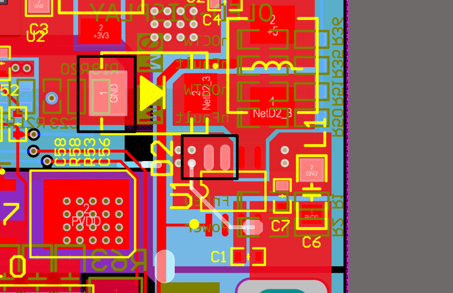
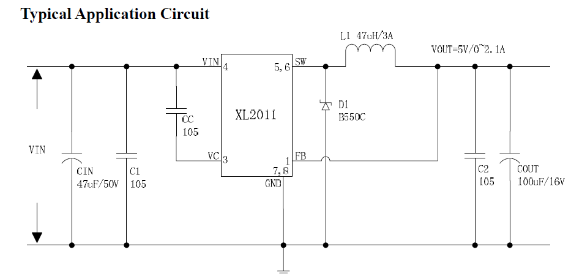
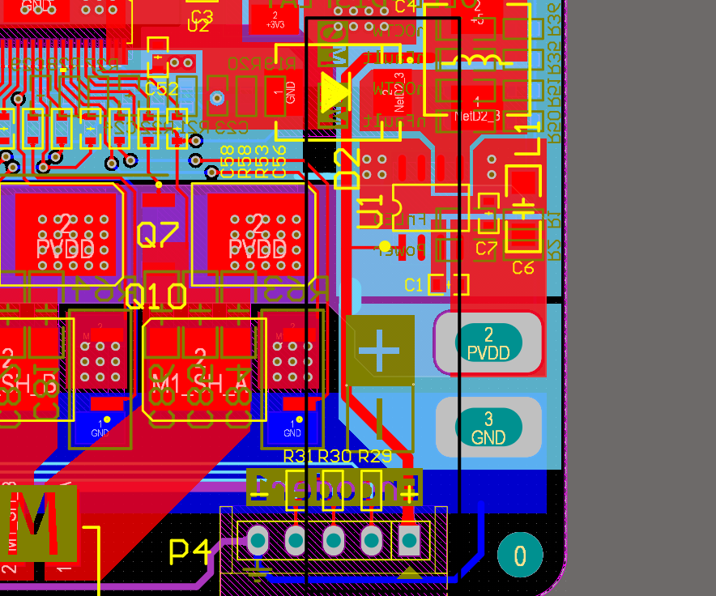
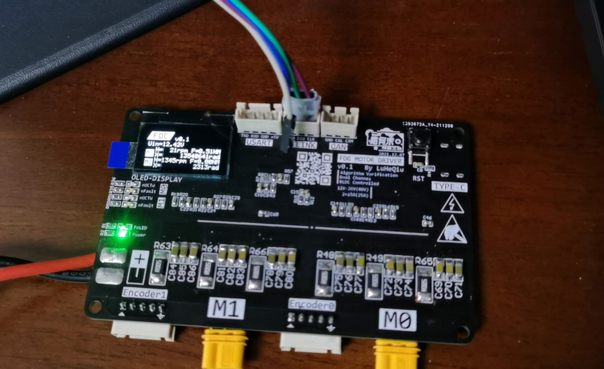

<!--
 * @Author       : LuHeQiu
 * @Date         : 2022-01-13 17:05:55
 * @LastEditTime : 2022-12-04 19:08:12
 * @LastEditors  : LuHeQiu
 * @Description  : 
 * @FilePath     : \motor-controller-with-foc\LOG.md
 * @HomePage     : https://www.luheqiu.com
-->

     
    <h1>
        
    </h1>
    <strong>路何求创想工坊出品 | 硬件&算法工坊</strong>

# 【FOC+STM32】双路直流无刷电机矢量控制器-维护日志

## LOG

### [2021.12.27] 焊接完成

前段时间完成了初步的焊接工作，并在焊接过程和焊接完成的电气测试中发现如下问题：

1. CJT1117引脚映射错误，具体为：2→3，3→1，1→2。本次为了先行验证整体是否可行，并寻找更多错误，通过旋转CJT1117芯片45°强行修改。实际制作等待 v0.2 版本进行调整。
2. KIA50N03的漏源耐压是30V，因此额定电压建议20V以下。如果需要30V以上的驱动电压，应当更换为KIA50N06。这个是我买错了，KIA50N06的耐压是60V。这两款MOSFET我均已购买，等后续性能测试再看看是否好用，不好用再换。（个人感觉这两款MOSFET都好便宜，每片不到1元。）
3. 此款128x64的OLED屏幕，可以使用 3 - wire SPI 进行通信，即片选CS、时钟SCK和数据MOSI。但是，在编写点灯代码（进行能否运行的可行性测试）的时候，仔细看了一下OLED数据手册，发现如果使用3线SPI通信，它的协议是非标的。OLED每帧数据需要九个时钟，传输九个比特，后面八位为传输的一个字节，第一位用于决定这个字节是命令还是数据。这就很难受了，这意味着我难以使用STM32的硬件SPI，也难以使用 “DMA+中断” 的方式进行数据传输，我需要使用软件模拟SPI接口，这一方面多占用了CPU，另一方面也浪费了为特地为通信留出来的支持配置为硬件SPI的引脚IO。**这说明：硬件设计也需要考虑数据手册的软件部分**
4. LED灯的丝印处，nOCTW和nFault的位置交换了。

顺带吐槽一句，不知道是因为黑色焊油的问题还是我焊接手法的问题，感觉这个板子的焊油层很容易磨掉啊，好几处都露出铜皮了。（还是说是某创板的问题？）

### [2022.01.09] 查找到两个硬件BUG

**BUG1:** 修复了主电源的问题

1. 在烧录代码的过程中，keil一直提示internal command error。但是从设置界面是可以读取到芯片的。之前也遇到过这种情况，一般通过重新插拔、上电均可解决，但这次不行。

2. 伴随着发现用手轻轻按压板子正面绝缘处会发现掉电，而轻轻按压板子背面不发生掉电。

3. 经筛查，掉电为DCDC开关电源芯片XL2011输出电压降至0.6 ~ 0.7V。此外，如果在板子5V接口处挂上负载，则无法正常上电，输出同样为0.6 ~ 0.7V，移开负载正常。如果空载则能够正常上电，5V成功输出后，挂上负载也能正常工作。

4. 通过更换XL2011输入输出侧的电容，按压板子使之掉电的情况缓解了一会儿，但随后又马上恢复原状。

5. 考虑是电源问题。初步怀疑是XL2011的质量，后发现是布板失误。下图黑色框框处分别为肖特基二极管的阳极和XL2011的7脚与8脚。此为经典的异步整流BUCK电路，D1提供电流回路，且频率较高，此处电流应当快速回至XL2011的地。其回路应当极可能短且尽可能小。

6. 通过旋转二极管和导线跳线使得输出电容负极和二极管阳极所接GND均尽快返回芯片的GND后，上述所有问题恢复正常。

    
    

6. 此处使用的二极管为SS56，平均输出整流电流可达5A，而实际上后级负载的电流几乎不超过100mA，即便挂上两路编码器和通讯负载也会不会超过200mA，使用SS56和XL2011过于浪费，且SS56封装庞大，占用过大的版面空间。可以更换为其他300 - 400mA左右的肖特基二极管。

7. v0.2电路将不使用XL2011，而使用其他的国产同步整流芯片。在提高效率的同时，省去肖特基二极管。

**BUG2:** 查找出了5V供电支路的问题

1. 在掉电问题中，更换电容初步缓解后，从远离开关电源的5V口可以带负载上电。而靠近开关电源的5V口仍然上电失败，开关芯片输出为0.6 ~ 0.7V。下图中，可以看到5V供电回路是从XL2011的输出脚和反馈脚之间的反馈回路引出的，这可能导致反馈出现问题使得降压输出失败。虽然通过上述BUG1的修复不再出现问题，但后续设计中也应当避免。

    

 

### [2022.01.13] 屏幕驱动编写完成

1. 完成了显示器屏幕驱动的编写，该部分代码分为三部分:
    + 通讯层 spi.c
    + 驱动层 screen_drive.c
    + GUI 层 lgui.c

2. 按照面向对象的思路进行逐层封装，以高内聚低耦合的原则进行了重构。以前用OLED或者SPI的屏幕驱动都是用商家的例程，着实有点不方便。特别是OLED，无法做到任意坐标随心随意的显示。

3. 三个层之间仅仅通过一两个API接口进行连接。

4. lgui.c实现了绘制点、矩形、图片和格式化字符输出。其中，格式化字符有类似于C语言printf的语法。提供%d、%3d、%.2f等格式的输入。

    

 

### [2022.12.04] FOC控制部分的开环回路完成

1. 完成了FOC控制部分的开环回路，该部分代码分为:
    + Park变换和Park反变换
    + Clarke变换
    + SVPWM算法

2. 对比了矩阵变换整合与幅角直接计算的SVPWM算法的速度
    + 矩阵变换方式（本工程目前所使用的）：10万次40ms
    + 幅角直接计算：10万次240ms

    虽然10万次运算240ms，运算一次2.4μs看起来也绰绰有余，但考虑到我期望设计的FOC控制周期在5KHz以上且尽可能更高（初步想法，后面有没有问题再说），还是打算尽可能节约时间。

3. 修复了一下数据上报的BUG、在上位机看寄存器回报值缺了高位零，不是很舒服，例如0x08只上报了0x8

4. 在设计变换函数的时候，需要用到Sin函数，本来打算直接查表法，发现精度差了点意思，用了math.h库函数又嫌弃太慢（可能也不慢，因为我后面发现了是一些重复计算的问题）。后来尝试了一下基于插值的查表Sin函数，后面又发现大参数的三角函数会因为float乘法导致精度丢失，搜了不少论文，发现参数缩减是一个非常数学的问题，研究了半天发现计算有点大，遂放弃，优化到后面，好奇了一下DSP库的Sin函数怎么实现的，怎么解决大参数缩减的问题，结果发现DSP库也是基于插值的查表法（笑哭），所以这算是重复造轮子吗？233。最后没有解决大参数问题，将就用了。

    速度对比：
    + 查表法：100万次167ms
    + 插值后的查表法：100万次350ms
    + DSP库：100万次337ms
    + Math库（解决了大参数问题）：100万次1200ms

