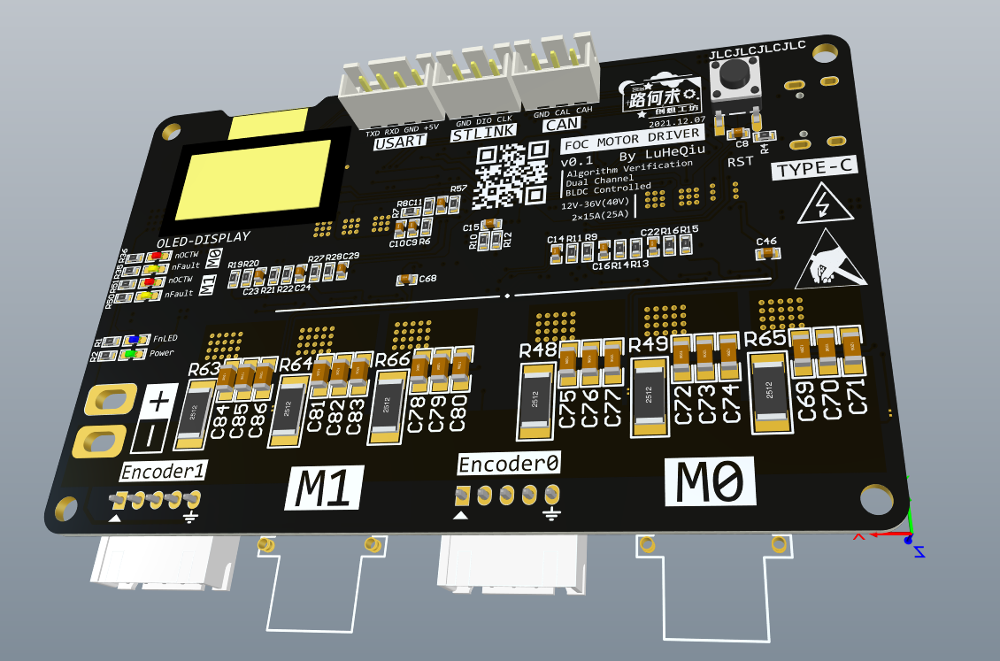
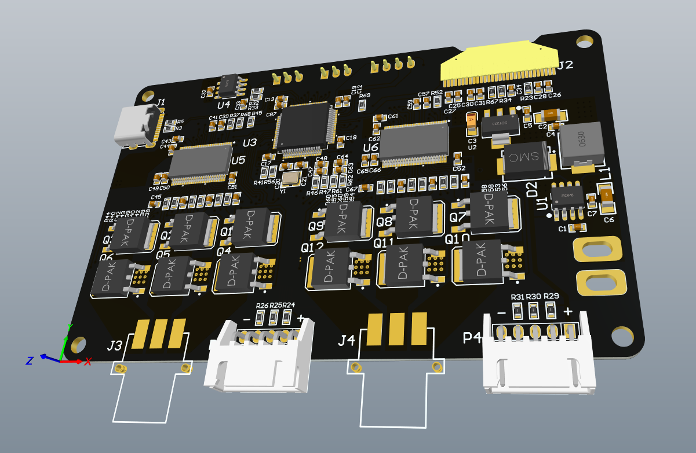
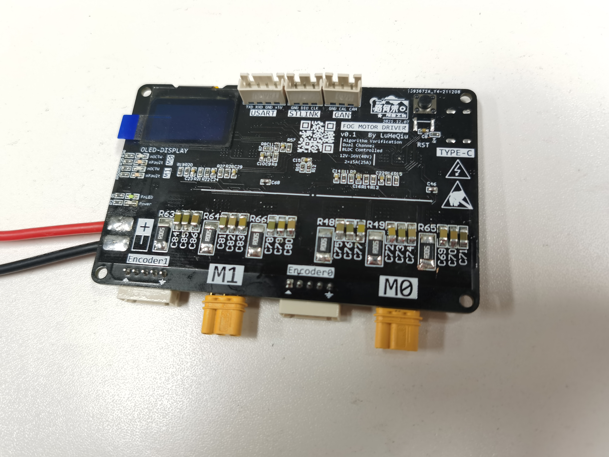
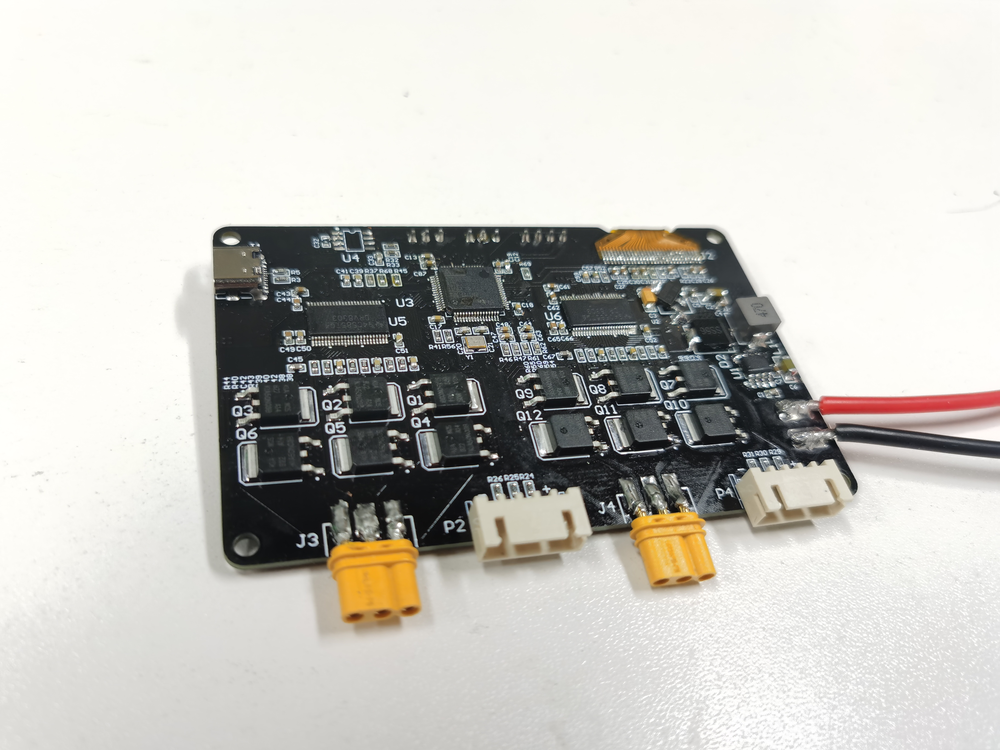

<!--
 * @Author       : LuHeQiu
 * @Date         : 2021-12-08 13:26:15
 * @LastEditTime : 2022-01-13 18:06:54
 * @LastEditors  : DeaneChen
 * @Description  : 
 * @FilePath     : \motor-controller-with-foc\README.md
 * HomePage     : https://luheqiu.com
-->

     
    <h1>
        
    </h1>
    <strong>路何求创想工坊出品 | 硬件&算法工坊</strong>

# 【FOC+STM32】双路直流无刷电机矢量控制器-使用文档

    
    
    
    
    

## 📕 介绍
控制器主控芯片采用STM32F405RGT6，控制器底层基于HAL库和FreeRTOS实时操作系统，预留CAN、USART、SWD、USB接口各一，便于通信和控制的工程应用。该控制器提供双路无刷电机控制，同时分别预留编码器接口与电压采样接口，适合于有感FOC与无感FOC的控制应用或算法验证。同时该控制板还可以适合于异步电机的矢量控制。

> **注意：此项目为硬件设计与算法验证项目，当前正处于设计和验证阶段，未进行完善的工程应用测试和极限参数的压力测试，请勿直接使用，以避免出现安全问题和财产损失，后续的验证情况会同步更新**

### 演示图片

    
    
    
    

### 什么是FOC
FOC，即Field Oriented Control的缩写，可以译为磁场定向控制或矢量控制。是一种针对异步电机或直流无刷电机的变频调速方式，具有以下几个特点：
+ 调速范围宽，具有良好低速特性与高速特性
+ 机械特性硬，转速稳定性好
+ 速度可以在整个调速范围内连续控制，平滑性好，可以实现无级调速
+ 可以实现力矩控制与力矩反馈
+ 结构复杂，算法复杂，贵

## 🎬 进度

### 日志

详见： [日志文档](./LOG.md "日志文档")

**[2021.12.27] 焊接完成**

**[2021.01.09] 查找到两个硬件BUG**

**[2021.01.13] 屏幕驱动编写完成**

## ✨ 参数

+ **规格**
    - 体积: 99.0mm × 71.5mm × 8.8mm

+ **性能**
    - 额定电压 **12V - 36V**
    - **双路**直流无刷电机驱动
    - 最大持续电流 **2 × 15A**
    - **支持**三相霍尔编码器（可根据需要选择性焊接上拉电阻）
    - **支持**最大不超过3PIN的数字编码器或其他编码器（如PWM信号的AS5600）
    - **不支持**需要ADC采样的模拟编码器

+ **功能**
    - 一个可编程LED灯，一个电源指示灯，四个电机状态指示灯
    - 板载 OLED 屏显（基于带片选的SPI通信）
    - 基于 2 × DRV8303 的双路电机驱动（与OLED共用SPI总线）
    - 提供 2 x 3 的UVW电压采样
    - 提供 2 x 2 的电流采样，分别为V相和W相

+ **接口**
    - CAN x 1
    - USART x 1
    - TYPE-C USB接口 x 1 (FS全速接口，不支持OTG，不支持供电)

## 📄 BOM表

**
FOC_Controller_BOM**

| Comment | Value | Designator | Quantity | Footprint | LibRef | Description | Price/pcs | Price |
|---------------|----------------|--------------------------------------------------------------------------------------------|----------|------------------------------|---------------|------------------------------------------------------------------------|-----------|-------------|
| Cap | 1μF | "C1, C4, C7, C30, C43, C44, C61, C62" | 8 | C 0603\_L | Cap | Capacitor | 0\.0031 | 0\.0248 |
| Cap Pol1 | 100μF | C2 | 1 | C 1206\_M | Cap Pol1 | Polarized Capacitor \(Radial\) | 0\.2 | 0\.2 |
| Cap Pol1 | 22μF | C3 | 1 | CD A\(3216\) | Cap Pol1 | Polarized Capacitor \(Radial\) | 0\.749 | 0\.749 |
| Cap | 10μF | C5 | 1 | C 0603\_M | Cap | Capacitor | 0\.0853 | 0\.0853 |
| Cap Pol1 | 47μF | C6 | 1 | C 1206\_M | Cap Pol1 | Polarized Capacitor \(Radial\) | 0\.2 | 0\.2 |
| Cap | 100nF | "C8, C15, C17, C18, C19, C32, C51, C52, C87" | 9 | C 0603\_L | Cap | Capacitor | 0\.0134 | 0\.1206 |
| Cap | 0\.01μF | C9 | 1 | C 0603\_L | Cap | Capacitor | 0\.0131 | 0\.0131 |
| Cap | 0\.1μF | "C10, C11, C14, C16, C22, C23, C24, C29, C38, C40, C42, C50, C56, C58, C60, C66" | 16 | C 0603\_L | Cap | Capacitor | 0\.0134 | 0\.2144 |
| Cap | 2\.2μF | "C12, C13, C26, C39, C57" | 5 | C 0603\_L | Cap | Capacitor | 0\.186 | 0\.93 |
| Cap | 20pF | "C20, C21" | 2 | C 0603\_L | Cap | Capacitor | 0\.025 | 0\.05 |
| Cap | 4\.7μF 16V X7R | C25 | 1 | C 0603\_L | Cap | Capacitor | 0\.1 | 0\.1 |
| Cap | 1μF 16V X5R | C27 | 1 | C 0603\_L | Cap | Capacitor | 0\.031 | 0\.031 |
| Cap | 4\.7μF | "C28, C34, C49, C65" | 4 | C 0603\_L | Cap | Capacitor | 0\.1 | 0\.4 |
| Cap | 1μF 16V | C31 | 1 | C 0603\_L | Cap | Capacitor | 0\.031 | 0\.031 |
| Cap | 47nF | C33 | 1 | C 0603\_L | Cap | Capacitor | 0\.025 | 0\.025 |
| Cap | 0\.022μF | "C41, C59" | 2 | C 0603\_L | Cap | Capacitor | 0\.025 | 0\.05 |
| Cap | 1000pF | "C45, C46, C67, C68" | 4 | C 0603\_L | Cap | Capacitor | 0\.025 | 0\.1 |
| Cap | 2200pF | "C47, C48, C63, C64" | 4 | C 0603\_L | Cap | Capacitor | 0\.025 | 0\.1 |
| Cap | 100μF | "C69, C70, C71, C72, C73, C74, C75, C76, C77, C78, C79, C80, C81, C82, C83, C84, C85, C86" | 18 | C 1206\_M | Cap | Capacitor | 0\.2 | 3\.6 |
| BLUE\_LED | | D1 | 1 | LED 0603B | LED2 | "Typical RED, GREEN, YELLOW, AMBER GaAs LED" | 0\.07 | 0\.07 |
| SS56 | | D2 | 1 | SMC | Diode BAS70 | Silicon AF Schottky Diode for High\-Speed Switching | 0\.4847 | 0\.4847 |
| GREEN\_LED | | D3 | 1 | LED 0603G | LED2 | "Typical RED, GREEN, YELLOW, AMBER GaAs LED" | 0\.04 | 0\.04 |
| YELLOW\_LED | | "D4, D6" | 2 | LED 0603Y | LED2 | "Typical RED, GREEN, YELLOW, AMBER GaAs LED" | 0\.045 | 0\.09 |
| RED\_LED | | "D5, D7" | 2 | LED 0603R | LED2 | "Typical RED, GREEN, YELLOW, AMBER GaAs LED" | 0\.045 | 0\.09 |
| USB\-C | | J1 | 1 | USB\-C\-SMD\_TYPE\-C\-USB\-5 | USB\-C/S | USB\-C型母接口 | 0\.4844 | 0\.4844 |
| OLED 128\*64 | | J2 | 1 | OLED 0\.96'' 128x64 | Header 30 | "Header, 30\-Pin" | 9\.75 | 9\.75 |
| 三相连接器\-插座 | | "J3, J4" | 2 | MR30PW\-M | 三相连接器\-插座 | | 2\.1 | 4\.2 |
| Inductor | 47μH/3A | L1 | 1 | L\-SMD\-0630 | Inductor | Inductor | 0\.7579 | 0\.7579 |
| USART | | P1 | 1 | SIPA04 | Header 4 | "Header, 4\-Pin" | 0\.04 | 0\.04 |
| M0\_Encoder | | P2 | 1 | SIPB05 | Header 5 | "Header, 5\-Pin" | 0\.06 | 0\.06 |
| CAN | | P3 | 1 | SIPA03 | Header 3 | "Header, 3\-Pin" | 0\.03 | 0\.03 |
| M1\_Encoder | | P4 | 1 | SIPB05 | Header 5 | "Header, 5\-Pin" | 0\.06 | 0\.06 |
| STLINK | | P5 | 1 | SIPA03 | Header 3 | "Header, 3\-Pin" | 0\.03 | 0\.03 |
| KIA50N03BD | | "Q1, Q2, Q3, Q4, Q5, Q6, Q7, Q8, Q9, Q10, Q11, Q12" | 12 | TO252 \- 3 | N\-MOSFET | | 0\.574 | 6\.888 |
| Res2 | 1K | "R1, R35, R36, R50, R51" | 5 | R 0603\_L | Res2 | Resistor | 0\.006 | 0\.03 |
| Res2 | 12K | R2 | 1 | R 0603\_L | Res2 | Resistor | 0\.006 | 0\.006 |
| Res2 | 22Ω | "R3, R5" | 2 | R 0603\_L | Res2 | Resistor | 0\.005974 | 0\.011948 |
| Res2 | 4\.7K | "R4, R24, R25, R26, R29, R30, R31, R41, R45, R56, R57, R68, R69" | 13 | R 0603\_L | Res2 | Resistor | 0\.006 | 0\.078 |
| Res2 | 43K | "R6, R9, R13, R15, R19, R21, R27" | 7 | R 0603\_L | Res2 | Resistor | 0\.006 | 0\.042 |
| Res2 | 3\.3Ω | R7 | 1 | R 0603\_L | Res2 | Resistor | 0\.009572 | 0\.009572 |
| Res2 | 3\.9K | "R8, R11, R14, R16, R20, R22, R28" | 7 | R 0603\_L | Res2 | Resistor | 0\.006 | 0\.042 |
| Res2 | 0Ω | "R10, R12" | 2 | R 0603\_L | Res2 | Resistor | 0\.006 | 0\.012 |
| Res2 | 910KΩ | R23 | 1 | R 0603\_L | Res2 | Resistor | 0\.006 | 0\.006 |
| Res2 | 60Ω | "R32, R33" | 2 | R 0603\_L | Res2 | Resistor | 0\.010254 | 0\.020508 |
| Res2 | 4\.7KΩ | "R34, R67" | 2 | R 0603\_L | Res2 | Resistor | 0\.006 | 0\.012 |
| Res2 | 1Ω | "R37, R52" | 2 | R 0603\_L | Res2 | Resistor | 0\.006207 | 0\.012414 |
| Res2 | 10 | "R38, R39, R40, R42, R43, R44, R53, R54, R55, R58, R59, R60" | 12 | R 0603\_L | Res2 | Resistor | 0\.006736 | 0\.080832 |
| Res2 | 56Ω | "R46, R47, R61, R62" | 4 | R 0603\_L | Res2 | Resistor | 0\.006778 | 0\.027112 |
| Res2 | 0\.005Ω 4W | "R48, R49, R63, R64, R65, R66" | 6 | R 2512\_M | Res2 | Resistor | 0\.006 | 0\.036 |
| SW\-PB | | S1 | 1 | TSW SMD\-6\*6\*5 | SW\-PB | Switch | 0\.2679 | 0\.2679 |
| XL2011 | | U1 | 1 | SOP8\_N | XL2011 | 5V/2\.1A DC\-DC Buck电源芯片\(<50V\) | 1\.9728 | 1\.9728 |
| CJT1117\-3\.3 | | U2 | 1 | SOT223\_N | Volt Reg | Voltage Regulator | 0\.6873 | 0\.6873 |
| STM32F405RGT6 | | U3 | 1 | LQFP64\-10x10mm | STM32F405RGT6 | No Description Available | 45 | 45 |
| TJA1040 | | U4 | 1 | SOP8\_N | TJA1040 | CAN收发器 | 9\.02 | 9\.02 |
| DRV8303 | | "U5, U6" | 2 | DCA48\_4P42X3P48 | DRV8303 | "THREE PHASE PRE\-DRIVER WITH DUAL CURRENT SHUNT AMPLIFIERS, DCA0048A" | 20 | 40 |
| 8MHz | | Y1 | 1 | OSC 3225\-4P | XTAL | Crystal Oscillator | 1\.9989 | 1\.9989 |
| | | | | | | | | |
| | | | | | | | Total | 129\.472486 |

## 🚀 快速上手
1. 可使用AD软件打开 *FOC_Controller.PcbDoc* 文件，根据需要进行修改或生成Gerber文件发送给PCB板厂进行制作。工艺为四层板，建议外层铜厚1oz及以上，内层铜厚0.5oz及以上。
2. 使用趁手的焊台进行焊接。
3. 检查焊接与上电是否正常。
4. 进行FOC控制代码的设计与验证。（或等我更新）

